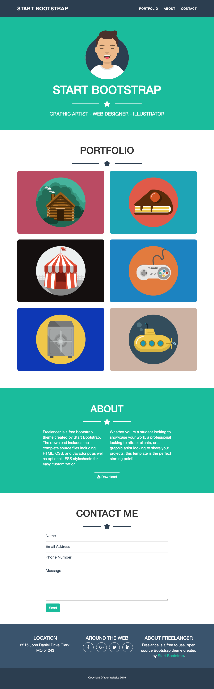

# Esercizio
Bootstrap Freelancer

## Consegna
Utilizziamo Bootstrap 5 per ricreare il template responsive Freelancer come da screenshots allegati.

<https://filippo-falcone.github.io/html-css-bootstrap-freelancer/>

